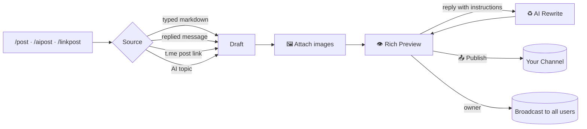

<div align="center">


### ⚡ `LEVEL 99 TELEGRAM BOT` ⚡
**Multi-AI · Native Rich Messages · Live Streaming Drafts · Channel Studio · Media Ripper**


</div>

---

## 🎮 `PLAYER SELECT` — AI Providers

<div align="center">

| ⚔️ Slot | 🤖 Fighter | 💥 Special Move |
|:--:|:--|:--|
| `/g` · `.g` | **Gemini** | Fast, multimodal reasoning |
| `/pr` · `.pr` | **Perplexity** | Live web-search answers |
| `/co` · `.co` | **Copilot** | Code + long-form writing |
| `/key` | **Key Inspector** | Scans ANY AI key → models, quota, limits |
| `/tryke` | **Model Test** | Fire a prompt at the scanned key |

</div>

> 🧬 **Combo system:** reply to any answer and the fight continues in that provider's memory.

---

## 🌈 `POWER-UP` — Rich Message Engine (Bot API 10.1)

 Every AI answer, tool output and post renders **natively**:

```
╔══════════════════════════════════════════════════════╗
║  H1–H3 HEADINGS   TABLES   LaTeX   TASK LISTS        ║
║  QUOTES   SPOILERS   CODE BLOCKS   COLLAPSIBLES      ║
║  IMAGE SLIDERS   MAPS   LINKS   LIVE STREAM DRAFTS   ║
╚══════════════════════════════════════════════════════╝
```

<details>
<summary><b>🧪 Show the markup cheat-sheet</b></summary>

| Effect | Syntax |
|:--|:--|
| Heading | `# H1` · `## H2` · `### H3` |
| Table | `\| A \| B \|` + `\|:--\|:--:\|` |
| Math | `$E = mc^2$` · block `$$ … $$` |
| Task list | `- [x] done` · `- [ ] todo` |
| Quote | `> takeaway` |
| Spoiler | `\|\|hidden\|\|` |
| Code | `` `x` `` or fenced block |
| Image | `!img https://…` (2+ → native slider) |
| Title | `!title My update` |
| Map | `!map[23.81,90.41]` |

</details>

> ⏱️ **Live draft streaming** — in private chats the answer types itself out in real time (Telethon MTProto), then locks into a final rich message. Falls back to safe HTML if anything is unsupported.

---

## 📡 `BOSS FEATURE` — Rich Channel Studio

<div align="center">

</div>



| 🎯 Command | 🎬 Action |
|:--|:--|
| `/addchannel @ch` | Register a channel (bot + you must be admin) |
| `/channels` · `/delchannel` | Manage registered channels |
| `/post [markdown]` | Compose manually or from a replied message |
| `/aipost <topic>` | AI writes the whole post |
| **`/linkpost <t.me/ch/123>`** | **Paste or reply to a channel post link → that channel is auto-targeted, the linked post is loaded as source, then generate & publish** |
| `/addimg <url>` · `/clearimg` | Multi-image slider control (up to 10) |
| `/richcast [ai <topic>]` | 👑 Owner: same studio → broadcast to every user |
| `/postformat` · `/cancelpost` | Cheat-sheet · abort |

> 💬 **Reply-to-refine:** answer the preview with *"shorter"*, *"বাংলায় লেখো"*, *"add a pricing table"*, *"drop the quote"* — the post is rewritten and previewed again until you're happy.

---

## 🕹️ `FULL COMMAND MAP`

<details open>
<summary><b>📝 Text Tools</b></summary>

| Command | Description |
|:--|:--|
| `/en <fmt> <text>` | Encode: Base64 / Hex / Binary / URL / ROT13 |
| `/de <fmt> <text>` | Decode from any common format |
| `/text <style> <text>` | Case change, reverse, and more |
| `/wc <text>` | Word & character counter |
| `/style <text>` | 49+ Unicode fonts with live preview buttons |

</details>

<details>
<summary><b>🌐 Language Tools</b></summary>

| Command | Description |
|:--|:--|
| `/spell` · `/gra` | Spelling suggestions · AI grammar fix |
| `/syn <word>` · `/prn <word>` | Synonyms · phonetics + audio |
| `/tr [lang] <text>` | AI translation (auto-detect) |
| `/ocr` | Read text from a replied photo (+ optional translate) |

</details>

<details>
<summary><b>🖼️ Photo Tools</b></summary>

| Command | Description |
|:--|:--|
| `/bg` | Background remover |
| `/enh` | Sharpen + colour boost |
| `/res` | Resize presets: YouTube / Instagram / Twitter / HD / 4K |

</details>

<details>
<summary><b>📥 Media Ripper</b></summary>

| Command | Description |
|:--|:--|
| `/dl <url>` | Instagram · TikTok · Facebook video downloader |
| `/dla <url>` | Extract MP3 audio |

**Hardened pipeline:** canonical URL cleaning, per-platform cookie jars (`IG_COOKIES_FILE`, `FB_COOKIES_FILE`, `TIKTOK_COOKIES_FILE`), Instagram media-id API path, embed + mirror fallbacks, TikWM route for TikTok, mobile/mbasic scrape for Facebook, photo-carousel support delivered as a **native image slider**, and HTML-consent-page detection so you never receive a broken file.

</details>

<details>
<summary><b>🔧 Utilities</b></summary>

| Command | Description |
|:--|:--|
| `/short <url>` | URL shortener |
| `/info` · `/ping` · `/top` | Account details · latency · leaderboard |
| `/m2t [ext] [text]` | Text → 70+ file formats |
| `/time <country>` | World clock + calendar |
| `/vnote` | Video → circular video note |
| `/convert [type] [value]` | Numbers, encodings, units, hashes |
| `/rich` · `/slide` | Rich engine status · native image slider demo |
| `/help [topic]` | AI-summarised help |

</details>

<details>
<summary><b>👑 Owner Console</b></summary>

| Command | Description |
|:--|:--|
| `/owner` · `/stats` · `/logs [n]` · `/users` | Control panel & telemetry |
| `/setchannel <user>` | Force-join gate (`off` to disable) |
| `/ban` · `/unban` · `/announce` · `/richcast` | Moderation & broadcasting |
| `/addprovider` · `/delprovider` · `/providers` | Hot-plug AI providers at runtime |

</details>

> 🎯 Every command also fires with a **dot prefix** — `.g hello` == `/g hello`

---

## 🛡️ `GUARD MODE`

Auto-approve, decline, or queue channel/group join requests — with an optional **captcha challenge** before entry.

---

## 🚀 `SPEEDRUN INSTALL`

```bash
git clone <repo> && cd <repo>
cp .env.example .env          # BOT_TOKEN, OWNER_ID, (API_ID/API_HASH for rich)
pip install -r requirements.txt
python main.py
```

Health check → `http://localhost:10000/health`

<details>
<summary><b>☁️ Deploy to Render (free tier)</b></summary>

1. Push to GitHub
2. Render → **New → Blueprint** → select this repo (`render.yaml` included)
3. Set `BOT_TOKEN`, `OWNER_ID`, optional `TELEGRAM_API_ID` / `TELEGRAM_API_HASH`
4. Deploy — the health endpoint keeps the service awake 24/7

</details>

<details>
<summary><b>🖥️ Deploy to VPS</b></summary>

```bash
python3 -m venv venv && source venv/bin/activate
pip install -r requirements.txt
nohup python main.py > bot.log 2>&1 &
```
Or install `systemd.service.example` as a proper service.

</details>

---

## ⚙️ `CONFIG SLOTS`

| Variable | Req | Purpose |
|:--|:--:|:--|
| `BOT_TOKEN` | ✅ | Token from [@BotFather](https://t.me/BotFather) |
| `OWNER_ID` | ✅ | Your numeric Telegram ID |
| `TELEGRAM_API_ID` / `TELEGRAM_API_HASH` | ⭐ | Unlocks native Rich Messages + live drafts ([my.telegram.org](https://my.telegram.org)) |
| `TELETHON_SESSION` | ❌ | StringSession for read-only filesystems |
| `RICH_MESSAGES` | ❌ | `off` to disable the rich engine |
| `FORCE_JOIN_CHANNEL` | ❌ | Force-join gate channel (no `@`) |
| `MONGODB_URI` | ❌ | Persist settings across redeploys |
| `IG_COOKIES_FILE` · `FB_COOKIES_FILE` · `TIKTOK_COOKIES_FILE` | ❌ | Netscape cookie jars for restricted media |
| `PUBLIC_URL` · `PORT` · `DB_PATH` | ❌ | Hosting knobs |

---

## 🧩 `MOD SUPPORT` — Add an AI Provider

```python
# bot/providers/__init__.py
register("ds", "DeepSeek", deepseek.ask)
```

Drop a module in `bot/providers/`, call `register()` → slash command, dot alias, menu button, and reply-to-continue all spawn automatically.

---

## 🗺️ `WORLD MAP`

```
.
├── bot/
│   ├── handlers.py        # commands, menus, routing
│   ├── richmsg.py         # Telethon MTProto rich engine (tables, LaTeX, sliders)
│   ├── richsend.py        # unified rich delivery + HTML fallback
│   ├── channel_post.py    # rich channel studio · link-post · broadcast
│   ├── downloader.py      # IG / TikTok / FB ripper with fallback chain
│   ├── db.py · mongo.py   # SQLite + optional MongoDB mirror
│   ├── providers/         # gemini · perplexity · copilot · custom
│   └── tools/             # text · language · photo · convert · ocr
├── main.py                # entrypoint + health server
└── render.yaml
```

---

## 🏆 `SAFETY ACHIEVEMENTS`

| 🎖 | Feature | Behaviour |
|:--:|:--|:--|
| 🛡 | Sanitisation | HTML/Markdown/LaTeX escaped or converted |
| ✂️ | Chunking | 4000-char safe splits |
| ⏱ | Timeouts | 120s guard on every provider call |
| 🧯 | Fallback chain | Rich → HTML → plain text, never a dead end |
| 📓 | Logging | Every exception persisted, never swallowed |
| 🚦 | Rate limiting | Serialised downloads for free-tier stability |

---

<div align="center">


### `GAME OVER? NEVER.` — MIT Licensed

**Made with 💙 for the Telegram community**


</div>
